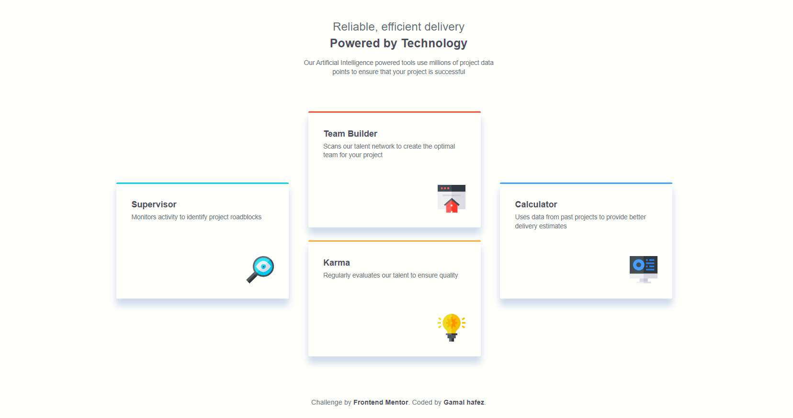

# Frontend Mentor - Four card feature section

This is a solution to the [Four card feature section challenge](https://www.frontendmentor.io/challenges/four-card-feature-section-weK1eFYK) on Frontend Mentor. It's a beginner-level project focused on creating a responsive feature layout using HTML and CSS.

## 📸 Screenshot

## 🔗 Live Site

👉 [View Live Site](https://gamalhafez.github.io/four-card-feature-challenge/)

## 🛠️ Built With

- Semantic HTML5
- CSS3 (Flexbox + Grid)
- Custom Fonts
- Responsive Design
- Git & GitHub

## 💡 What I Learned

- How to use CSS Grid and Flexbox together
- Building component-based layout structure
- Designing responsive sections with cards
- Implementing mobile-first approach
